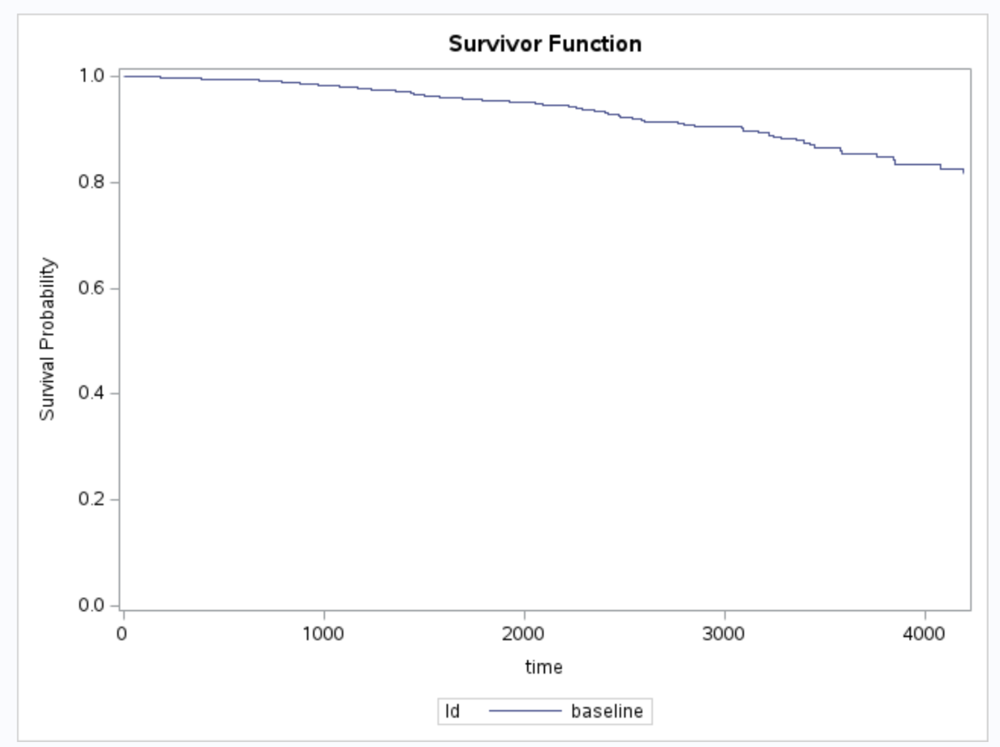

# Question 1

**In order to understand the dose-response relationship in abecma discussed in Slides 16-19, what would be your approaches to address the reviewers’ questions?**

* a. Potential confounding factors for the observed dose-response in efficacy

There are more than 100 baseline characteristics, according to the information given in the slides. Therefore, first, I will identify potential confounding factors and reduce the number of influential characteristics, using the method of hypothesis testing or step-wise variable selection.

Second, I would identify prognostic factors, which actually predicted the outcomes. Additionally, each factor was tested individually by controlling the dose, and significant factors were kept as the confounding factors.

Third, I would control all the selected confounding factors, because some of their dose-response relationships were more significant for certain endpoints. 

Last, multiplicity issues should be discussed for multiple tests.


* b. If there were any dose by baseline interactions

The interactions can exist in any forms, but I think the simplest method to test them is to explore the correlation, make visual inspection of the data, and refer to the reality and the definition of each factor. 

Once the calculation or visualization feels it, we can apply statistical analysis to get statistically significant interactions. However, We may not finally get the exact form of interactions, even we use state-of-art methods.

\newpage


# Question 2

## a) Please estimate the survival time that 90% subjects survived for baseline survival function.

```{r , echo=FALSE, fig.cap="Crude Survival Data", out.width = '80%', fig.align='center'}

```


```{r p2a-survcurve, echo=FALSE, fig.cap="Survival Fucntion for Baseline Covariates", out.width = '60%', fig.align='center'}

```

```{r , echo=FALSE, fig.cap="Targeted interval for Baseline", out.width = '80%', fig.align='center'}

```
Based on the results above, it is projected that 90% of individuals survived for 3090 days during the baseline survival function.


\newpage


## b) Please estimate the survival time that 90% subjects survived for male subjects who had edema and stage=4 and taking median for all other covariates in the model.

```{r , echo=FALSE, fig.cap="Taking Median for All Other Covariates", out.width = '80%', fig.align='center'}

```


```{r , echo=FALSE, fig.cap="Survival Fucntion for Male Subjects", out.width = '80%', fig.align='center'}

```


```{r , echo=FALSE, fig.cap="Targeted interval for Male Subjects", out.width = '80%', fig.align='center'}

```

Based on the results, the estimated survival time for male subjects with edema and stage = 4, after adjusting for medians of all other covariates, was 348 days, for 90% of the subjects.

\newpage

# Question 3

**Perform model selection using backward selection using PBC data.**

* Step 0. The model contains the following effects:

trt sexn ascites hepato spiders edema bili albumin copper alk.phos ast protime stage

* Step 1. Effect ascites is removed. The model contains the following effects:

trt sexn hepato spiders edema bili albumin copper alk.phos ast protime stage

* Step 2. Effect trt is removed. The model contains the following effects:

sexn hepato spiders edema bili albumin copper alk.phos ast protime stage

* Step 3. Effect spiders is removed. The model contains the following effects:

sexn hepato edema bili albumin copper alk.phos ast protime stage

* Step 4. Effect hepato is removed. The model contains the following effects:

sexn edema bili albumin copper alk.phos ast protime stage

* Step 5. Effect alk.phos is removed. The model contains the following effects:

sexn edema bili albumin copper ast protime stage

The final result is shown as below:

```{r , echo=FALSE, fig.cap="Backward Result", out.width = '80%', fig.align='center'}

```


\newpage

# SAS CODE

#### P2 a
proc import out = PBC
	datafile = "/home/u63668108/PBC.csv"
	dbms = csv replace;
	getnames = yes;
run;

data PBC;
	set PBC;
	if sex='f' then sexn=0; else sexn=1;
	
	if chol="NA" then chol="";
    if trig="NA" then trig="";
    if platelet="NA" then platelet="";
    chol_new = input(chol, 8.);
    drop chol;
    rename chol_new=chol;
    trig_new = input(trig, 8.);
    drop trig;
    rename trig_new=trig;
    platelet_new = input(platelet, 8.);
    drop platelet;
    rename platelet_new=platelet;
data covar;
	length Id $20;
	input Id $1-10 sexn edema bili albumin copper ast protime stage ; 
	datalines;
baseline  0 0 0 0 0 0 0 0
;
run;

proc phreg data=PBC plots(overlay)=survival;
	class sexn;
	model time*status(0) = sexn edema bili albumin copper ast protime stage;
	baseline covariates=covar out=Pred1 survival=_all_/rowid=Id; 
run;

proc print data=Pred1(FIRSTOBS = 120 OBS = 130); run;

#### P2 b

proc import out = PBC
	datafile = "/home/u63668108/PBC.csv"
	dbms = csv replace;
	getnames = yes;
run;

data PBC;
	set PBC;
	if sex='f' then sexn=0; else sexn=1;
	
	if chol="NA" then chol="";
    if trig="NA" then trig="";
    if platelet="NA" then platelet="";
    chol_new = input(chol, 8.);
    drop chol;
    rename chol_new=chol;
    trig_new = input(trig, 8.);
    drop trig;
    rename trig_new=trig;
    platelet_new = input(platelet, 8.);
    drop platelet;
    rename platelet_new=platelet;


proc means data=PBC median;
var bili albumin copper ast protime;
run;

data covar2;
	length Id$ 50;
	input sexn edema bili albumin copper ast protime stage Id $30-60;
	datalines;
	1 1 1.4 3.53 73 114.7 10.6 4 sexn=1 edema=1 stage=4
	;
run;

proc phreg data=PBC plots(overlay)=survival;
	class sexn;
	model time*status(0) = sexn edema bili albumin copper ast protime stage;
	baseline covariates=covar2 out=Pred2 survival=_all_/rowId=Id;
run;

proc print data=Pred2(FIRSTOBS = 15 OBS = 25); run;

#### P3

proc phreg data=PBC;
  class trt sexn;
  model time*status(0) = trt sexn ascites hepato spiders edema bili albumin copper alk.phos 
  ast protime stage/selection=backward sls=0.1; 
run;


# SAS DOCUMENT
https://support.sas.com/documentation/cdl/en/statug/68162/HTML/default/viewer.htm#statug_glmselect_details07.htm

# Github Link

https://github.com/zk2275/Survival_Analysis_HW6

